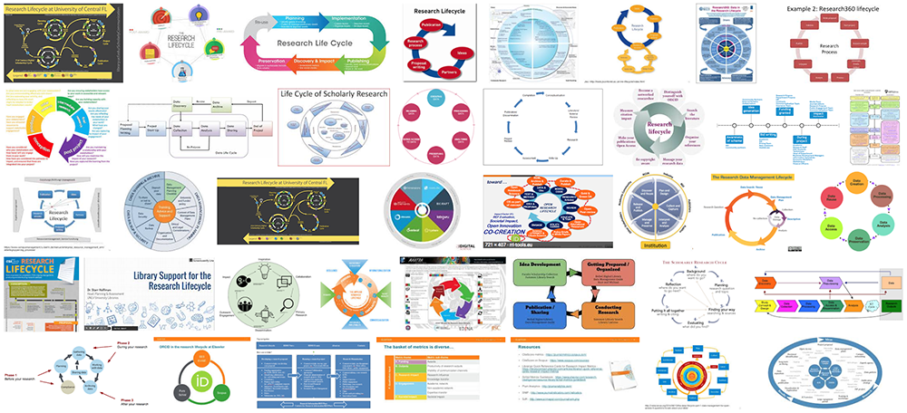

@title[Introduction]
## Post-Award Checklist
Brian Dietz @diuhtez 
NCSU Libraries
---
@title[The Team]
### Best Teammates Ever

 
Bertha Chang | Sonoe Nakasone
Note: Collaboration with Bertha and Sonoe, as well as others on RDC
---
@title[Research Data Committee]
### Research Data Committee
- Core team with rotating membership
- Draws from across Libraries
- Extends expertise beyond specialists
Note: The Libraries RDC has been operating in an organized way since 2011. Functional roles from across the Libraries are represented on the committee, which includes a core team. One rationale to this approach is to extend expertise beyond the core team to librarians who interact with research data, and who can offer their perspectives to the committee.
---
@title[RDC approach]
### Targeted and Nimble
- DMPs, workshops, copyright, promotion, and compliance
- Focused on supporting researchers up to the point of grant application
- Looking for strategic way to assist researchers with what happened post-award
Note: The work of the RDC has focused on supporting researchers up to the point of their grant application, and has focused on a DMP review service and internal workshops. With our DMP becoming more mature and more active, there's been a desire to offer services to researchers manage their data post-award.
---
@title[Post-Award Checklist]
### Post-Award Checklist
Note: One tool we've recently developed is what we call, simply, a "Post Award Checklist"
---
@title[Checklist]
### Why a checklist for researchers?

> A checklist is a type of informational job aid used to reduce failure by compensating for **potential limits of human memory and attention**. It helps to ensure **consistency and completeness** in carrying out a task.

https://en.wikipedia.org/wiki/Checklist

Note: From a general perspective, why might a checklist be useful? What should we expect a researcher's expertise to be? Both Materials Science and Engineering AND information management? A checklist, as a tool to compensate for the limits of our mental capacity, could help people adhere to their DMPs and manage their data effectively.
---
@title[Investment]
### Why a Checklist for the committee?
- Relatively low commitment
- Potentially high impact
- Iterative process
Note: At the same time, from the RDC's perspective, a checklist was attractive because we could quickly prototype a tool that might have an impact. Alternately, if it was a failure, it would have been a fairly small investment of time. Either way, the process could be iterative: we could roll something out, get feedback, improve, and repeat.
---
@title[Environmental scan]
### Environmental Scan
- Poked around web (unsystematic)
- Emailed DataCure list
- Responses
 - Data Stewardship Action Team
 - Johns Hopkins University Libraries
 - National Center for Atmospheric Research
Note: Naturally we started with an environmental scan to make sure no one had done this. We started by poking around the web, which was inefficient. Bertha sent a message to the DataCure list. We receive three responses. DSAT (complicated, not ready for prime time); JHS (oriented to DMP reviews); NCAR (well-developed but specialized to them); seemed to indicate an interest and a need
---
@title[Audience]
### For a general audience, by generalists
Note: With that in mind...we could not tailor a checklist for a certain domain or lab, and we did not want to presume too much about how researchers conduct their research
---
@title[Research Lifecycle]
### Data Lifecycle as Map for Data Management
> ...you principally have to worry about the data management practices for whatever part of the lifecycle you are currently in.

Kristin Briney, [Data Management for Researchers](http://dataabinitio.com/?page_id=672)
Note: https://catalog.lib.ncsu.edu/record/NCSU3913377 We ultimately found Kristin Briney's Data Management for Researchers to be the most useful model.
---
@title[Research Lifecycle]
### Data Lifecycle

Note: We started by referencing various research lifecycle models. There are lot to choose from, some are extremely complicated and would not map to a checklist, and we wanted to make this a simple tool for researchers to use.
---
@title[Research Lifecycle]
### Lifecycle: Sections
- Before you begin
- As you begin your research
- As you’re acquiring and analyzing
- When it’s time to publish
- When it’s time to share
- When it’s time to “preserve” your output
- When it’s all done
- All along the way
Note: Tried to break down the lifecycle into simple sections that excluded jargon and would map across domains. So we used broad categories like before you do X, as you're doing Y, all along the way.
---
@title[Checklist Items]
### Checklist Items
- Roles
- Documentation
- File management
- Backup and preservation
- Identifying repositories
Note: Four pages, 35 items
---
@title[Resources]
### Resources
- Their own DMP
- The Libraries
- IRB
- Campus IT
- College research officers
Note: Other than their own DMP and the Libraries, we also refer checklist users to the IRB, campus IT, and college research officers, among other campus resources
---
@title[Sharing]
### Sharing as a Google Doc
- Quick to deploy
- Easy to share
- Add to your Drive as edit as necessary
- Iterate if/when necessary (version control, too)

http://go.ncsu.edu/post-award_dmpchecklist
Note: We created the draft checklist as google doc, but then we decided it was the ideal to share at least the early version of it. One appeal, since we knew our version couldn't cover specifics of all users, is that researchers can add it to their own Drives and edit as needed.
---
@title[Campus feedback]
### Campus Feedback
- Institutional Review Board
- Office of Research, Innovation, and Economic Development
Note: We have shared with a limited audience to date. Our campus IRB reviewed it and advised that the checklist would be useful to use when researchers were completing the IRB application. Their hope was tighter integration between DMP and checklist with IRB.
---
@title[Annotated copy]
### Public vs Annotated Copies

> Good checklists...are precise. They are efficient, to the point, and easy to use...They do not try to spell out everything...

Atul Gawande, [Checklist Manifesto](http://atulgawande.com/book/the-checklist-manifesto/)

Note: The initial draft was much more detailed than the latest version. After reviewing with other committee members, we decided to move some checklist items into comments that liaisons could refer to when meeting with researchers to discuss implementing the checklist. The staff full-edit is annotated; the annotations are not visible in the public, read-only view. The result is that we have one canonical copy, not two. 
---
@title[Additional work]
### Ongoing and future work
- Contacting researchers
  - Research Admin Data and Reporting follow up
- Web presence
- Promotion to community
Note: edit
---
@title[Campus Support]
### Campus Support
- [IRB Submission Guidance page](https://sites.textiles.ncsu.edu/research/data-mangagement)
- [College of Textiles Research Resources site](https://sites.textiles.ncsu.edu/research/data-mangagement)
---
 @title[Monitoring]
### Monitoring use
Note: NCSU link shortener, one way to track; additional web tracking via Google Analytics
---
@title[Going live]
### Soliciting feedback
Note: edit
---
@title[Thanks]
http://go.ncsu.edu/post-award_dmpchecklist  
 
Feedback: library_datamanagement@ncsu.edu
