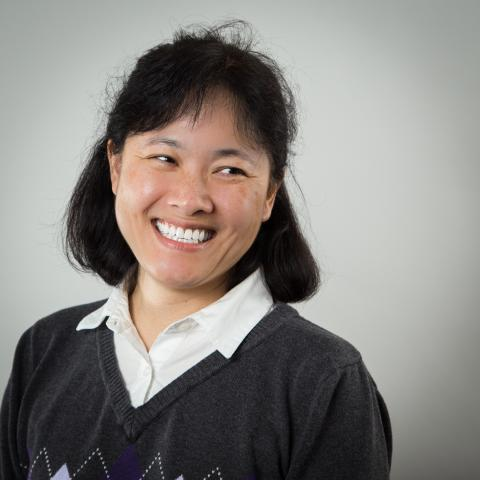
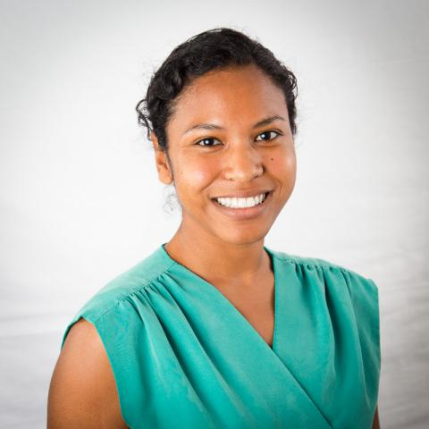

@title[Introduction]
## Post-Award Checklist
Brian Dietz @diuhtez 
NCSU Libraries
---
@title[Introduction]
### My Collaborators

Note: introduce Bertha and Sonoe
---
@title[RDC]
### RDC as context
- targeted, nimble
- make up
- focus on dmp and workshops and compliance and promotion
- work had been focused on up to the point of grant application
- looking for strategic way to assist researchers with what happened after grant was awarded
Note: edit
---
@title[Checklist]
### Checklist
- seemed useful
- wouldn't over commit us to a tool that researchers may not take up
Note: edit
---
@title[Environmental scan]
### performed an environmental scan
- Datacure email
- Note on what we found, useful but different than what we were hoping for
- Seemed to indicate both an interest and a need
Note: edit
---
@title[Lifecycle]
### sections follow research "lifecycle"
Note: edit
---
### Approachable terms
- "Before you start"
- "When you’re ready to share"
- Workflow references (simple and otherwise)
- Whose work did we reference
Note: edit
---
@title[Campus feedback]
### sought feedback from IRB and research admin
Note: edit
---
@title[Annotated copy]
### shared vs annotated copies
- linked to from IRB and one college
Note: edit
---
@title[Go link]
### go link for tracking
http://go.ncsu.edu/post-award_dmpchecklist
CC 0
Note: edit
---
@title[Additional work]
### Ongoing and future work
- RADAR DMP follow up
- Contacting researchers
Note: edit
---
@title[Monitoring]
### Monitoring use (via web stats)
Note: edit
---
@title[Going live]
### Soliciting feedback
Note: edit
---
@title[Thanks]
### Thanks
http://go.ncsu.edu/post-award_dmpchecklist
